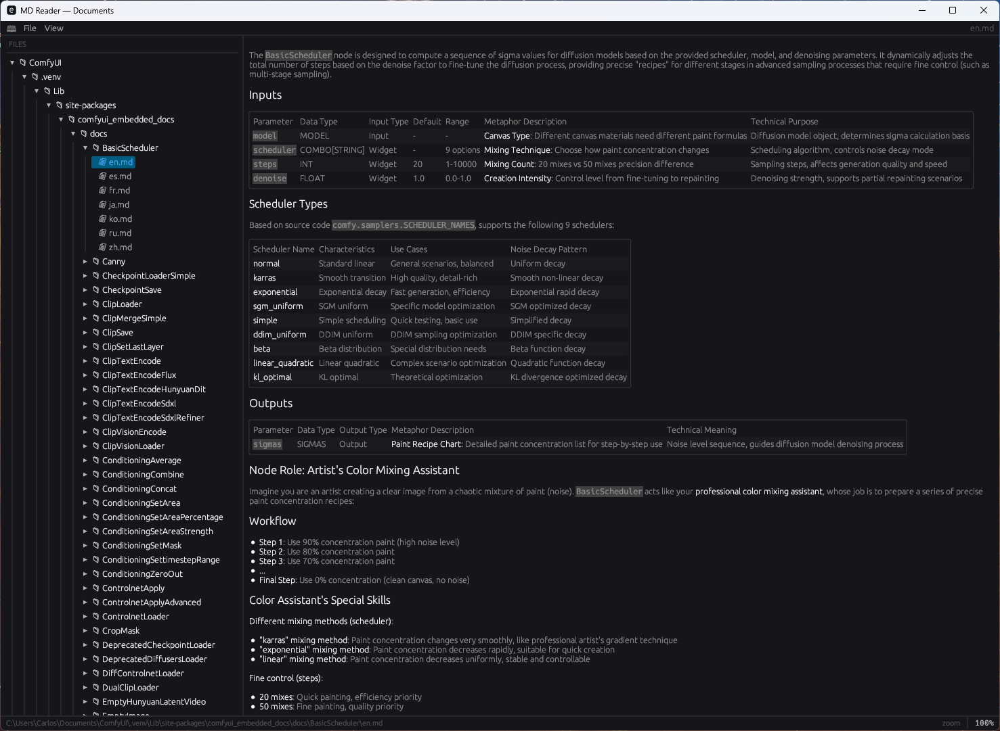

<p align="center">
  
</p>

# MDReader

A read-only Windows desktop markdown viewer built with Rust and egui/eframe.

MDReader scans a configurable root directory for `.md` files, presents them in a collapsible sidebar tree, and renders the selected file as formatted markdown — including syntax-highlighted code fences — in the main panel.

---

## Features

- **Recursive file tree** — scans the root directory and all subdirectories for `.md` files; directories containing no markdown are omitted automatically.
- **Collapsible sidebar** — folders are shown as collapsible headers, sorted directories-first then alphabetically. The currently open file is highlighted.
- **Rendered markdown** — full commonmark rendering via `egui_commonmark`, including headings, tables, blockquotes, inline code, and fenced code blocks.
- **Syntax highlighting** — fenced code blocks with language tags (` ```rust `, ` ```python `, ` ```bash `, etc.) are rendered with full syntax colouring via the `syntect` backend bundled with `egui_commonmark`.
- **Light / dark mode** — toggle under View menu; preference is saved immediately.
- **Zoom control** — drag the `%` label in the status bar left or right for continuous scaling (range 25–400%), or pick a preset from View > 75% / 100% / 125% / 150% / 200% / Reset zoom. The zoom level is persisted across sessions.
- **Root folder as TOC title** — the sidebar header displays the root folder name, making the tree act as a named table of contents for the documentation set.
- **Export to PDF** — **File > Export as PDF…** converts the current file to a styled PDF via Chrome/Edge headless rendering; greyed out when no file is open.
- **File menu** — Settings (pick root directory via native folder picker), Refresh tree, Export as PDF, Quit.
- **Persistent config** — root path, theme, and zoom are written to `%APPDATA%\MDReader\config.json` on every change; defaults to the system Documents folder on first run.
- **Native feel** — single self-contained `.exe`, no installer required, application icon embedded at compile time via `winres`.

---

## Interface

<p align="center">
  
</p>

### File tree (left sidebar)

The sidebar is populated at startup by recursively walking the configured root directory. The tree builder applies three rules before anything is displayed:

- **Directories are omitted if they contain no `.md` files** at any depth — empty or non-markdown folders never appear.
- **Sort order is directories-first, then alphabetical** within each level, matching the convention of most file explorers.
- **Nesting is unlimited** — the screenshot shows a six-level hierarchy (`ComfyUI → .venv → Lib → site-packages → comfyui_embedded_docs → docs → BasicScheduler`) rendered without any depth cap.

Each folder is a collapsible `CollapsingHeader`. Clicking a folder toggles it open or closed without triggering a file load. Clicking a `.md` file loads and renders it immediately; the active file is highlighted in blue.

The title bar reflects the root folder in use (`MD Reader — Documents` in the screenshot). Changing the root via **File > Settings** rebuilds the tree from scratch and resets the active file.

### Markdown renderer (right panel)

The content panel renders the selected file using `egui_commonmark` against the full CommonMark spec:

- **Tables** — column widths are sized to content; the panel scrolls horizontally if a table overflows.
- **Inline code and code fences** — monospaced with background highlight; fenced blocks with a language tag (` ```python `, ` ```rust `, ` ```bash `, etc.) receive full syntax colouring via the `syntect` engine.
- **Bold, italic, blockquotes, bullet lists, headings** — all rendered natively by the egui widget layer with no HTML or WebView involved.

### Status bar

The bottom bar shows two pieces of information simultaneously:

| Left | Right |
|---|---|
| Full absolute path of the open file | Zoom percentage — drag left/right to scale the entire UI |

Zoom changes are previewed live in the percentage label during drag and committed to disk only on release, keeping the coordinate system stable throughout the gesture.

---

## Requirements

- Windows 10 or 11 (64-bit)
- [Rust toolchain](https://rustup.rs/) 1.75 or later (stable)

No additional system libraries are required. All dependencies are compiled into the binary.

---

## Build

```
cargo build --release
```

The compiled binary is placed at:

```
target\release\mdreader.exe
```

The `build.rs` script uses `winres` to embed the application icon into the `.exe` at compile time. Ensure `assets\icon.ico` is present in the repository root before building (it is committed to version control).

To run a debug build during development:

```
cargo run
```

---

## Usage

1. Launch `mdreader.exe`.
2. On first run the root directory defaults to your Documents folder. Open **File > Settings** to choose a different root.
3. The left sidebar lists all `.md` files found under the root. Click a folder header to expand or collapse it; click a file to open it.
4. The rendered markdown appears in the right panel with a scrollable view.
5. Use **View > Dark mode / Light mode** to toggle the colour scheme.
6. Adjust zoom by dragging the percentage label in the bottom-right status bar, or via **View** menu presets.
7. Use **File > Refresh tree** to rescan the root after adding or removing files on disk.
8. Use **File > Export as PDF…** to save the currently open file as a styled PDF (requires Chrome or Edge).

The application is read-only by design — it never writes to any markdown file.

---

## Configuration file

Settings are stored at:

```
%APPDATA%\MDReader\config.json
```

Example:

```json
{
  "root_path": "C:\\Users\\Alice\\Documents\\notes",
  "dark_mode": true,
  "zoom": 1.25
}
```

The file is created automatically on first run and updated on every settings change. You can edit it manually while the application is closed.

---

## Dependencies

| Crate | Version | Purpose |
|---|---|---|
| eframe | 0.28 | Native windowing and GPU-accelerated rendering (egui backend) |
| egui_commonmark | 0.17 | Commonmark markdown rendering with syntect syntax highlighting |
| serde / serde_json | 1 | Config serialisation |
| dirs | 5 | Platform-aware paths (Documents, AppData) |
| rfd | 0.14 | Native file/folder picker dialog |
| comrak | 0.28 | Markdown → HTML conversion for PDF export |
| winres | 0.1 | Embed icon into the Windows `.exe` at build time |

---

## Roadmap

- **Linux package** — build a `.deb` (and optionally `.AppImage`) via GitHub Actions on tagged releases.
- **macOS bundle** — produce a signed `.app` bundle via GitHub Actions for Apple Silicon and Intel targets.
- **Search** — full-text search across all indexed markdown files.
- **Recent files** — quick-access list of recently opened documents.
- **External link handling** — open HTTP/S links in the default browser on click.
- **PDF batch export** — export all files under a folder to a single merged PDF.
